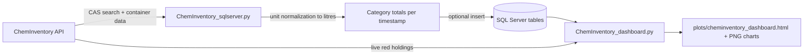

# ChemInventory

This page explains how these two scripts work together:

- `Labsense_SQL/ChemInventory_sqlserver.py`
- `Labsense_SQL/ChemInventory_dashboard.py`

If you see the name `ChemInvenotry_sqlserver` elsewhere, that is a typo. The actual file in this repository is `ChemInventory_sqlserver.py`.

## 1. What Each Script Does

### `ChemInventory_sqlserver.py`

Purpose:

- Calls the ChemInventory API for each solvent in the project solvent list (`gsk_2016`).
- Converts container sizes/units into litres.
- Aggregates totals into red/yellow/green volumes for each category:
  - `chemComposite`
  - `chemIncineration`
  - `chemVOC`
  - `chemAquatic`
  - `chemAir`
  - `chemHealth`
- Optionally inserts one new timestamped row per category into SQL Server.

Key behavior:

- Requires `CHEMINVENTORY_CONNECTION_STRING` (ChemInventory auth token) for API access.
- Uses retries for transient HTTP failures.
- Filters out ChemInventory location `527895` before summing held volume. This location in the exemplar inventory corresponds to chemicals on order, that have not yet been delivered.
- Uses unit conversion factors from `Labsense_SQL/constants.py`.
- SQL inserts are controlled by `CHEMINVENTORY_INSERT_TO_SQL`.

CLI modes:

- Default mode: run full API fetch and SQL sync (`main()`).
- Export mode: `--export-red-csv` writes a red-category holdings CSV (no SQL insert path).

### `ChemInventory_dashboard.py`

Purpose:

- Reads historical category totals from SQL Server tables listed above.
- Builds trend plots per category.
- Calls `get_red_category_chemical_volumes()` to add a live table of currently held red-classified chemicals.
- Writes an HTML dashboard (default: `plots/cheminventory_dashboard.html`).

Key behavior:

- Expects SQL tables to already contain data (normally from `ChemInventory_sqlserver.py`).
- Also needs `CHEMINVENTORY_CONNECTION_STRING` because it fetches the live red holdings list.

## 2. End-to-End Data Flow



## 3. Required Configuration

Create `Labsense_SQL/.env` (or update it) with at least these values:

```env
# ChemInventory API auth token (required)
CHEMINVENTORY_CONNECTION_STRING=your_cheminventory_api_token

# Toggle SQL writes from ChemInventory_sqlserver.py
CHEMINVENTORY_INSERT_TO_SQL=True

# SQL Server connection
SQL_SERVER=YOUR_SQL_SERVER_INSTANCE
SQL_DATABASE=labsense
SQL_TRUSTED_CONNECTION=yes
SQL_ENCRYPTION=Optional

# Optional
PLOTS_DIR=plots
LOG_LEVEL=INFO
```

Important:

- `CHEMINVENTORY_CONNECTION_STRING` is mandatory for API calls.
- Without it, `ChemInventory_sqlserver.py` raises a runtime error.
- `ChemInventory_dashboard.py` also needs it because it fetches live red-category holdings.

## 3.1 Change the Hardcoded Inventory ID

The ChemInventory inventory ID is currently hardcoded as `873` in two places inside `Labsense_SQL/ChemInventory_sqlserver.py`.

Update both lines to your own ChemInventory inventory ID:

- In `get_red_category_chemical_volumes()` payload: `"inventory": 873`
- In `main()` payload: `"inventory": 873`

If you change only one location, you can get mismatched behavior (for example, SQL sync querying one inventory while red-category live holdings query another).

## 4. Prerequisites

- Conda environment created from `environment.yml`.
- SQL Server reachable from the machine running these scripts.
- ODBC Driver 18 for SQL Server installed.
- Valid ChemInventory API token with access to inventory ID `873` (as currently hardcoded).

## 5. Setup and First Run

1. Create and activate environment.

```bash
conda env create -f environment.yml
conda activate labsense
```

2. Add/update `Labsense_SQL/.env` with the variables above.

3. Optional validation of API token only (CSV export path):

```bash
python Labsense_SQL/ChemInventory_sqlserver.py --export-red-csv
```

Expected output: a CSV in `plots/red_category_chemicals.csv` (or custom path via `--output`).

4. Run full ChemInventory sync to SQL:

```bash
python Labsense_SQL/ChemInventory_sqlserver.py
```

This writes one row per category to SQL when `CHEMINVENTORY_INSERT_TO_SQL=True`.

5. Generate dashboard:

```bash
python Labsense_SQL/ChemInventory_dashboard.py
```

Outputs:

- `plots/cheminventory_dashboard.html`
- `plots/*_trends.png` for each category with available SQL data

## 6. Useful CLI Options

### `ChemInventory_sqlserver.py`

- `--export-red-csv`: export current red-category holdings to CSV.
- `--output <path>`: custom output path for export mode.

### `ChemInventory_dashboard.py`

- `--plot-dir <dir>`: where PNG plots (and default HTML) are written.
- `--out <file>`: custom HTML output path.
- `--connection-string <conn>`: override SQL connection string at runtime.

## 7. Troubleshooting

### Error: `CHEMINVENTORY_CONNECTION_STRING is required`

- Add `CHEMINVENTORY_CONNECTION_STRING` to `Labsense_SQL/.env`.
- Confirm the token is valid and not expired.

### Dashboard says no SQL data found

- Run `python Labsense_SQL/ChemInventory_sqlserver.py` first.
- Verify SQL connection settings and SQL permissions.
- Ensure `CHEMINVENTORY_INSERT_TO_SQL=True`.

### SQL insert skipped

- Check `CHEMINVENTORY_INSERT_TO_SQL` is one of: `1`, `true`, `yes`.
- Confirm SQL connection values are correct and ODBC driver is installed.

### Partial/zero volumes

- Some containers may be skipped if size/unit is missing or unknown.
- Check log file at `C:\Labsense\Logs\lastChemInventoryLog.txt`.

## 8. Security Notes

- Treat `CHEMINVENTORY_CONNECTION_STRING` as a secret.
- Keep `.env` out of version control.
- Prefer machine or CI secret stores for production scheduling.
