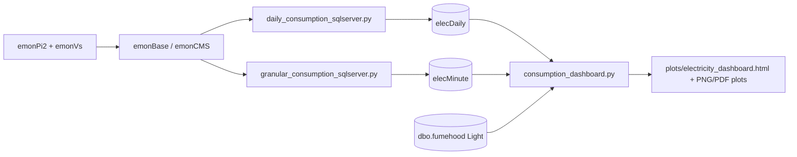

# Electricity Monitoring

This page explains how these three scripts work together:

- `Labsense_SQL/daily_consumption_sqlserver.py`
- `Labsense_SQL/granular_consumption_sqlserver.py`
- `Labsense_SQL/consumption_dashboard.py`

## 1. Measurement and Data Source

Lab electricity consumption is measured using an OpenEnergyMonitor emonPi2 system (six CT channels) with an emonVs precision AC voltage sensor.

Data are logged in emonCMS via an emonBase station, then retrieved through authenticated emonCMS HTTP API calls returning JSON time-series data.

Official emonCMS API reference: [https://emoncms.org/site/api](https://emoncms.org/site/api)

## 2. What Each Script Does

### `daily_consumption_sqlserver.py`

#### Purpose

- Fetches daily cumulative feed values from emonCMS.
- Calculates daily usage as: `Esum_end - Esum_start`.
- Inserts one row per day into SQL table `elecDaily`.
- Creates `elecDaily` automatically if missing.

#### Key behavior

- Uses emonCMS endpoint: `/feed/data.json` with `mode=daily`.
- Uses feed ID `21` (currently hardcoded in the script URL).
- Skips inserts when a `Datestamp` already exists.
- Default run inserts yesterday only.

### `granular_consumption_sqlserver.py`

#### Purpose

- Fetches 1-minute average cumulative feed values from emonCMS.
- Computes interval energy by differencing consecutive points.
- Inserts minute-level interval energy rows into SQL table `elecMinute`.
- Creates `elecMinute` automatically if missing.

#### Key behavior

- Uses emonCMS endpoint: `/feed/average.json` with `interval=60`.
- Uses feed ID `21` (currently hardcoded in the script URL).
- Stores per-minute interval energy as `EnergyValue` with interval-end `Timestamp`.
- Skips duplicate timestamps already in SQL.
- Supports exporting SQL minute rows for one date to CSV.

### `consumption_dashboard.py`

#### Purpose

- Reads daily data from `elecDaily` and minute data from `elecMinute`.
- Builds electricity plots and an HTML dashboard (`plots/electricity_dashboard.html` by default).
- Optionally estimates idle power from minute data and compares active vs total power.

#### Key behavior

- Fetches last 7 days of minute-level data for high-resolution views.
- Converts minute interval energy to power using `Power_kW = EnergyValue * 60`.
- Computes idle power from 01:00-05:00 points (`hour >= 1 and < 5`) by mean power.
- Pulls fumehood light data and aligns room presence for previous-day delta clustering.
- Generates day/week/month views plus PNG/PDF plot assets.

## 3. End-to-End Data Flow



## 4. Required Configuration

Create `Labsense_SQL/.env` with at least:

```env
# EmonCMS API
EMONCMS_API_KEY=your_emoncms_api_key
EMONCMS_BASE_URL=https://your-emoncms-host

# SQL Server
SQL_SERVER=YOUR_SQL_SERVER_INSTANCE
SQL_DATABASE=labsense
SQL_TRUSTED_CONNECTION=yes
SQL_ENCRYPTION=Optional

# Optional output location
PLOTS_DIR=plots
```

Important:

- `EMONCMS_API_KEY` and `EMONCMS_BASE_URL` are required by both ingestion scripts.
- `EMONCMS_BASE_URL` must include `http://` or `https://`.
- SQL settings must point to a reachable SQL Server with ODBC Driver 18 available.

## 5. SQL Tables Used

The ingestion scripts auto-create these tables if they do not exist:

- `elecDaily(id, Esum, Datestamp)`
- `elecMinute(id, EnergyValue, Timestamp)`

## 6. Running the Pipeline

From repository root in the `labsense` environment:

1. Insert daily electricity values (default: yesterday):

```bash
python Labsense_SQL/daily_consumption_sqlserver.py
```

2. Insert minute-level electricity values (default: yesterday):

```bash
python Labsense_SQL/granular_consumption_sqlserver.py
```

3. Generate dashboard and plots:

```bash
python Labsense_SQL/consumption_dashboard.py
```

Useful options:

- Backfill a date range:

```bash
python Labsense_SQL/daily_consumption_sqlserver.py --start-date 2026-01-01 --end-date 2026-01-31
python Labsense_SQL/granular_consumption_sqlserver.py --start-date 2026-01-01 --end-date 2026-01-31
```

- Export one day of `elecMinute` SQL data to CSV:

```bash
python Labsense_SQL/granular_consumption_sqlserver.py --export-date 2026-01-15
```

## 7. Idle Consumption Method in Dashboard

When `CALCULATE_IDLE_POWER = True` in `consumption_dashboard.py`:

1. Minute-level `EnergyValue` (kWh per minute) is converted to kW using `* 60`.
2. Records from 01:00 up to (but excluding) 05:00 are selected.
3. Idle power is the mean of these kW values.
4. Active power is plotted as `max(Power_kW - IdlePower_kW, 0)`.

This provides a practical baseline estimate for non-operational demand during assumed unoccupied hours.

## 8. Troubleshooting

### Error: `EMONCMS_API_KEY not found` or `EMONCMS_BASE_URL not found`

- Add both variables to `Labsense_SQL/.env`.
- Confirm the `.env` file is in `Labsense_SQL/`.

### Error: `EMONCMS_BASE_URL must include a scheme`

- Use full URL, for example `https://emoncms.example.org`.

### No data in dashboard

- Run both ingestion scripts first.
- Confirm `elecDaily` and `elecMinute` contain rows for recent dates.

### Duplicate rows skipped

- This is expected behavior; both ingestion scripts skip timestamps/dates already present.

### Presence clustering missing or empty

- Dashboard uses `dbo.fumehood` light readings and configured LabId/SubLabId.
- If no compatible light/presence data exists, presence defaults are used and cluster output may be reduced.
