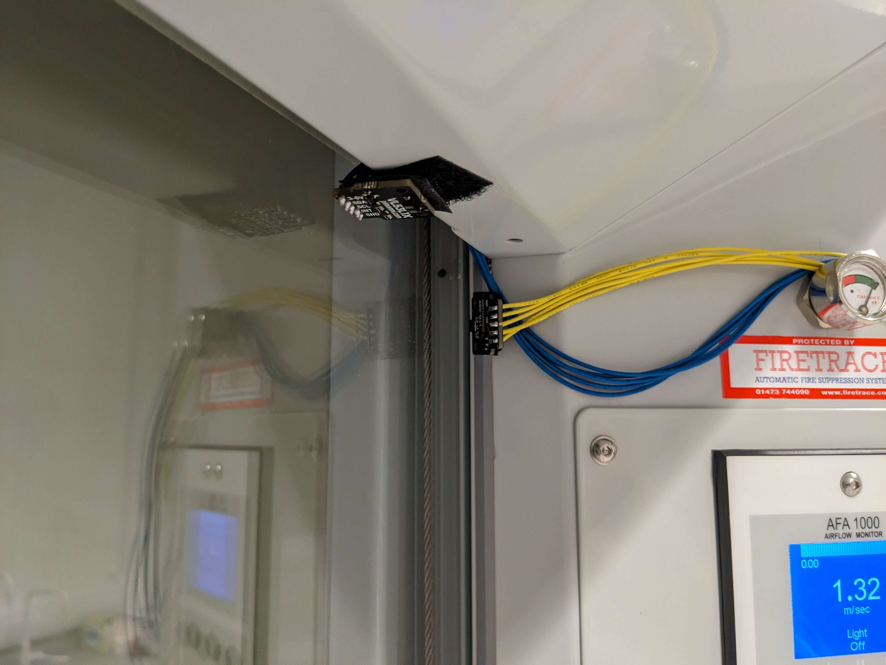

# Fumehood Monitoring

This section documents the fumehood monitoring system in LabSense, including real-time sensor data collection,
dashboard generation, and sash opening state analysis.

## Relevant Modules

- **Labsense_Sensors/fumehood.py**: Real-time sensor collection and MQTT publishing for fumehood distance and light sensors.
- **Labsense_SQL/Fumehood_dashboard.py**: Dashboard generation script that queries SQL Server data and creates visualizations.
- **Labsense_Sensors/fumehood_helpers.py**: Helper functions for sensor configuration and management.

## System Overview

The fumehood monitoring system tracks:

1. **Sash opening distance**: Measured via ToF (Time-of-Flight) distance sensor (VL53L1X)
   - Calibrated distance readings converted to percentage open
   - Monitors when fumehood sash is opened/closed
   
2. **Ambient light level**: Measured via light sensor (LTR559)
   - Determines if fumehood lights are on/off based on configurable thresholds
   - Identifies light sensor errors (readings above 500 lux or extended zero readings)

3. **Data collection and recovery**:
   - Configurable retry strategies for sensor read failures
   - Automatic sensor recovery mechanisms before reboot
   - Resilient error handling and logging

## Typical Workflow

1. **Sensor Collection** (Labsense_Sensors/fumehood.py):
    - Reads distance and light sensors at regular intervals from Raspberry Pi
    - Applies retry logic and sensor recovery if needed
    - Publishes measurements to MQTT broker with lab and fumehood identifiers
    - Logs all activity and errors

2. **Data Ingestion**:
    - MQTT messages are received and stored in SQL Server database
    - Distance and light measurements tagged with timestamps, lab_id, and sublab_id

3. **Dashboard Generation** (Labsense_SQL/Fumehood_dashboard.py):
    - Queries SQL Server for fumehood sensor data (grouped by laboratory and sublaboratory)
    - Calculates sash opening percentages using calibration data
    - Identifies light sensor errors and anomalies
    - Generates visualizations showing sash state, light status, and error patterns
    - Produces an HTML dashboard for viewing trends and diagnostics

## Setting up Fumehood Sensors

### Hardware Requirements

- Raspberry Pi (tested on Pi Zero 2 W and Pi 4 Model B)
- VL53L1X Time-of-Flight distance sensor (I2C connection)
- LTR559 ambient light sensor (I2C connection)
- Appropriate wiring and connections to I2C bus

{ .img-70 }

### Sensor Configuration

Fumehood sensors are configured via `Labsense_Sensors/.env` file. Key settings include:

#### MQTT Configuration
- `MQTT_SERVER`: MQTT broker hostname/IP
- `MQTT_PORT`: MQTT broker port (default: 1883)
- `MQTT_PATH`: MQTT topic path for publishing measurements
- `MQTT_TIMEOUT`: Connection timeout in seconds

#### Lab and Sensor Identity
- `LAB_ID`: Laboratory identifier
- `SUBLAB_ID`: Fumehood/sublaboratory identifier
- Used to tag all measurements for proper organization

#### Distance Sensor (VL53L1X) Configuration
- `TOF_I2C_BUS`: I2C bus number (typically 1 on Raspberry Pi)
- `TOF_I2C_ADDRESS`: I2C address in hex (e.g., 0x29)
- `TOF_RANGING_MODE`: 1=Short, 2=Medium, 3=Long range
- `TOF_TIMING_BUDGET_US`: Measurement timing budget in microseconds (optional)
- `TOF_INTER_MEASUREMENT_MS`: Measurement interval in milliseconds (optional)

#### Light Sensor (LTR559) Configuration
- Automatically initialized if LTR559 module is available
- Requires I2C connectivity

#### Measurement Interval
- `MEASUREMENT_INTERVAL`: Time between sensor readings in seconds

#### Sensor Retry and Recovery Strategies

**Distance Sensor Retry Configuration**:
- `DISTANCE_SAMPLE_COUNT`: Number of samples to take per measurement
- `DISTANCE_SAMPLE_DELAY_SECONDS`: Delay between samples
- `DISTANCE_ZERO_RETRY_COUNT`: Retries if zero distance detected (likely sensor error)
- `DISTANCE_ZERO_RETRY_DELAY_SECONDS`: Delay between zero-distance retries
- `DISTANCE_WARMUP_DISCARD_COUNT`: Initial readings to discard after sensor start/recovery
- `DISTANCE_WARMUP_DISCARD_DELAY_SECONDS`: Delay during warmup discard phase

**Light Sensor Retry Configuration**:
- `LIGHT_SAMPLE_COUNT`: Number of samples to take per measurement
- `LIGHT_SAMPLE_DELAY_SECONDS`: Delay between samples
- `LIGHT_ZERO_RETRY_COUNT`: Retries for zero light readings (potential error)
- `LIGHT_ZERO_RETRY_DELAY_SECONDS`: Delay between zero-reading retries
- `LIGHT_I2C_ERROR_RETRY_COUNT`: Retries on I2C communication errors
- `LIGHT_I2C_ERROR_RETRY_DELAY_SECONDS`: Delay between I2C error retries
- `LIGHT_WARMUP_DISCARD_COUNT`: Initial readings to discard after sensor initialization
- `LIGHT_WARMUP_DISCARD_DELAY_SECONDS`: Delay during light warmup phase

**Recovery and Reboot Thresholds**:
- `LIGHT_READ_ERROR_REINIT_THRESHOLD`: Number of read errors before reinitializing light sensor
- `PROACTIVE_REINIT_INTERVAL_SECONDS`: Regular interval for proactive sensor reinitialization
- `ZERO_DISTANCE_REBOOT_THRESHOLD`: Consecutive zero-distance errors before reboot
- `ZERO_LIGHT_REINIT_THRESHOLD`: Consecutive zero-light errors before sensor recovery
- `IDENTICAL_LIGHT_REINIT_THRESHOLD`: Identical consecutive light readings before recovery
- `RECOVERY_FAILURE_BACKOFF_SECONDS`: Delay after failed recovery attempt
- `RECOVERY_CIRCUIT_BREAKER_THRESHOLD`: Number of failures before circuit breaker activates
- `RECOVERY_CIRCUIT_BREAKER_WINDOW_SECONDS`: Time window for circuit breaker threshold
- `RECOVERY_EXIT_ON_CIRCUIT_BREAKER`: Exit if circuit breaker activates (true/false)

#### Sensor Validation Thresholds
- `DISTANCE_MIN_MM`: Minimum valid distance reading (mm)
- `DISTANCE_MAX_MM`: Maximum valid distance reading (mm)
- `LIGHT_MIN_LUX`: Minimum valid light level (lux)
- `LIGHT_MAX_LUX`: Maximum valid light level (lux)

#### Logging Configuration
- `LOG_RETENTION_DAYS`: Number of days to retain log files
- `LOG_ROTATE_WHEN`: When to rotate log file (e.g., "midnight", "H" for hourly)

### Running the Sensor Monitor

```bash
# Activate the labsense environment
conda activate labsense

# Run the fumehood sensor monitor on the Raspberry Pi
python Labsense_Sensors/fumehood.py
```

The sensor will initialize both the distance and light sensors, then continuously:
- Read measurements from both sensors
- Apply retry logic if sensor reads fail or return suspicious values
- Attempt recovery (sensor reinitialization) if faults accumulate
- Publish valid measurements to the MQTT broker
- Log all activity to console and rotating file log

## Generating the Fumehood Dashboard

### Prerequisites

- SQL Server connectivity configured in `Labsense_SQL/.env`
- Sensor data ingested and stored in the labsense database via MQTT
- Required environment variables: `SQL_SERVER`, `SQL_DATABASE`, `SQL_TRUSTED_CONNECTION`, `SQL_ENCRYPTION`

### Dashboard Configuration

The dashboard script includes hardcoded calibration data for converting distance to sash opening percentage:

```python
FUMEHOOD_CALIBRATION = {
    (lab_id, sublab_id): {
        "fully_closed_mm": distance_when_closed,
        "fully_open_mm": distance_when_open
    }
}
```

**Excluded Distance Ranges**:
- Used to exclude erroneous sensor readings from error detection
- Specified as a list of `{"min": mm, "max": mm}` ranges per fumehood
- Example: clustering of false readings at specific distances can be excluded

### Light Threshold Configuration

Light thresholds are queried from the database via `presence_utils.get_light_threshold()`:
- `light_on_threshold_lux`: Minimum light level to consider lights "on"
- Lab and sublab specific thresholds supported

### Running the Dashboard

```bash
# Generate fumehood dashboard
python Labsense_SQL/Fumehood_dashboard.py [optional arguments]

# With optional arguments:
python Labsense_SQL/Fumehood_dashboard.py \
    --start-date "2024-01-01" \
    --end-date "2024-01-31" \
    --output-dir "./dashboards"
```

### Dashboard Outputs

The dashboard generates:

1. **HTML Dashboard**: Interactive visualization showing:
   - Sash opening percentage over time (% open for each fumehood)
   - Light on/off status
   - Error regions highlighted (light sensor or distance anomalies)
   - Presence data correlated with fumehood usage
   - Laboratory and sublaboratory organization

2. **Visualizations**:
   - Time-series plots of distance and sash opening
   - Light status timeline
   - Error detection results
   - Presence overlays showing correlation with fumehood activity

## Key Features

### Sash State Analysis

The system calculates sash opening percentage based on calibrated distance values:

- **Calibration**: Each fumehood has known distance values for fully closed and fully open states
- **Conversion**: Distance readings are converted to percentage open (0-100%)
- **Distance Clamping**: Readings beyond the fully closed distance are treated as fully closed (0%)
- **State Detection**: Thresholds can determine if sash is "open" for safety monitoring

### Light Sensor Error Detection

The system identifies light reading anomalies:

- **Zero Reading Errors**: Runs of 0 lux readings less than 10 consecutive points are flagged as errors
- **Sustained Darkness**: 10+ consecutive zero readings are considered valid (actual darkness)
- **High Reading Errors**: All readings above 500 lux are flagged as errors
- **Error Visualization**: Error regions are highlighted in the dashboard for diagnostics

### Sensor Recovery and Resilience

**Sensor Initialization and Recovery**:
- Both sensors are initialized with error handling
- VL53L1X and LTR559 modules checked for availability
- Configurable I2C timing and ranging parameters

**Fault Tolerance**:
- Retry strategies for sensor read failures
- Zero-distance and zero-light detection triggers recovery
- Identical consecutive light readings trigger reinitializations
- Proactive reinitialization at configured intervals

**Graceful Degradation**:
- System logs which sensors are unavailable
- Continues operation with available sensors
- Reboots only after all recovery options exhausted
- Circuit breaker pattern prevents infinite recovery loops

### Logging

Comprehensive logging to both console and rotating file log:

- All sensor initialization events
- Read operations and their results
- Retry attempts and recovery triggers
- Recovery success/failure
- Clean shutdown events
- File logs rotate based on time-of-day or size
- Configurable retention period

---

## Troubleshooting

### Distance Sensor Not Initializing

- Check I2C bus and address configuration match hardware
- Verify VL53L1X module is installed on the Raspberry Pi
- Test I2C connectivity: `i2cdetect -y <bus_number>`

### Light Sensor Not Initializing

- Verify LTR559 module is installed on the Raspberry Pi
- Check I2C connectivity to light sensor
- Review sensor logs for specific error messages

### MQTT Connection Failures

- Verify MQTT broker is running and accessible
- Check `MQTT_SERVER` and `MQTT_PORT` configuration
- Ensure network connectivity from Raspberry Pi to broker
- Review logs for connection error details

### Sensor Readings Seem Incorrect

- Check calibration data in dashboard script matches your hardware setup
- Review excluded distance ranges if certain values appear erroneous
- Examine light threshold configuration in the database
- Inspect sensor logs for read errors or recovery attempts

### Frequent Sensor Reboots

- Adjust retry counts and delays to be more lenient
- Consider extending `ZERO_DISTANCE_REBOOT_THRESHOLD`
- Review recovery failure backoff and circuit breaker settings
- Inspect physical sensor connections and wiring
- Check I2C bus for electrical noise or communication issues
