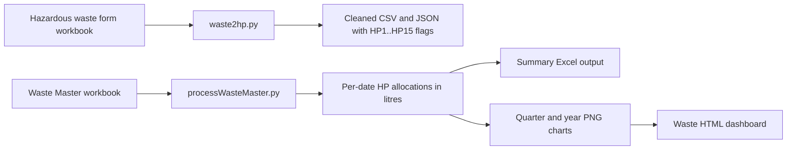

# Waste Generation Pipeline

This page explains how the Waste scripts work together to convert hazardous waste records into HP-code analytics and a dashboard.

## Relevant Scripts

- `Waste/waste2hp.py`: extracts and normalizes rows from a hazardous waste form workbook.
- `Waste/processWasteMaster.py`: aggregates Waste Master entries into HP1..HP15 volume totals and builds charts/dashboard.
- `Waste/tests/test_normalization.py`: verifies code normalization and extraction behavior.
- `Waste/tests/test_processWasteMaster.py`: verifies HP allocation and unit conversion behavior.

## 1. What Each Script Does

### `waste2hp.py`

Purpose:

- Reads a hazardous waste form workbook.
- Detects the header row and maps source columns to normalized names.
- Parses hazard code cells into structured lists.
- Normalizes code formats (for example `HP06` becomes `HP6`).
- Expands hazard properties into integer flags `HP1` to `HP15`.
- Writes cleaned CSV and JSON outputs.

Key behavior:

- If the requested sheet is not found, it falls back to `2.1 Waste Form` or another sheet containing `waste form`.
- Rows without a numeric reference are dropped.
- Output filenames include the provided `--date` value.

### `processWasteMaster.py`

Purpose:

- Reads the Waste Master workbook.
- Converts `Size` + `Unit` values to litres.
- Allocates each row across active HP flags to avoid double counting.
- Aggregates by `Date` and `HP Number`.
- Writes an output Excel summary and optional plots/HTML dashboard.

Key behavior:

- Default workbook path is `Z:\LabsenseDashboard\Waste Master.xlsx`.
- Unit multipliers come from `Labsense_SQL/constants.py` (`to_litre`).
- Unknown units are warned and treated with multiplier `1.0`.
- Minor legacy column-name variants are handled (for example `Unnamed: 0` -> `Date`).

## 2. End-to-End Data Flow



## 3. Allocation Method (Important)

Waste entries may carry multiple hazardous properties. To prevent double counting, `processWasteMaster.py` splits each row's volume evenly across all active HP flags.

Example:

- A row has `2.5 L`, with `HP1=1` and `HP2=1`.
- Active HP count is `2`.
- Allocation is:
  - `HP1 += 1.25 L`
  - `HP2 += 1.25 L`

So, total waste volume remains correct while HP composition is represented fairly.

## 4. Input Expectations

## Template Compatibility Notice

The hazardous waste form handling in `Waste/waste2hp.py` is currently designed around the University of Cambridge prescribed waste form template, specifically version 6.1.

Because header detection and column normalization are based on that layout and wording, other institutional templates may not parse correctly without updates.

If you use a different template, expect to amend script logic such as:

- `COLUMN_MAP` mappings,
- header-row detection (`detect_header_row`),
- and any template-specific cleaning assumptions.

### `waste2hp.py` expected content

- A sheet containing reference and hazard-property fields.
- Typical columns include reference, chemical/waste description, container size, hazard statements, and hazard properties.

### `processWasteMaster.py` expected content

Required columns (or supported fallbacks):

- `Date`
- `Size`
- `Unit`
- One or more `HP` columns (`HP1` ... `HP15`)

Fallbacks supported:

- `Unnamed: 0` -> `Date`
- `Unnamed: 3` -> `Size`
- `Unnamed: 4` -> `Unit`
- `Unnamed: 1` -> `Ref`

## 5. Running the Scripts

From repository root in the `labsense` environment.

### 5.1 Extract and normalize hazardous waste form

```bash
python Waste/waste2hp.py --excel "Waste/Hazardous waste form - RCE 2025July25.xlsx"
```

Useful options:

- `--sheet <name>`: choose a worksheet.
- `--out-csv <path>`: custom CSV output.
- `--out-json <path>`: custom JSON output.
- `--date YYYY-MM-DD`: date to append to each row.

### 5.2 Build waste summary, plots, and dashboard

```bash
python Waste/processWasteMaster.py --excel "Z:\LabsenseDashboard\Waste Master.xlsx" --out Waste.xlsx
```

Useful options:

- `--plot-dir <dir>`: write charts/dashboard assets to a directory.
- `--dashboard-file <file>`: custom HTML dashboard output path.
- `--no-plots`: skip plot generation.
- `--no-dashboard`: skip HTML dashboard generation.

If `--plot-dir` is not provided, the script uses:

1. `PLOTS_DIR` environment variable (if set), else
2. the parent directory of the input Excel file.

## 6. Outputs

### `waste2hp.py`

- `hazardous_waste_table_cleaned_<date>.csv`
- `hazardous_waste_table_cleaned_<date>.json`

### `processWasteMaster.py`

- Excel summary (default `Waste.xlsx`) containing `Date`, `HP Number`, `Volume(L)`.
- PNG plots:
  - `<prefix>_total_by_quarter.png`
  - `<prefix>_by_quarter_stacked.png`
  - `<prefix>_total_by_year.png`
  - `<prefix>_by_year_stacked.png`
- HTML dashboard:
  - `<prefix>_dashboard.html` (unless overridden)

## 7. Troubleshooting

### Error: Waste Master file not found

- Confirm `--excel` points to a valid file.
- If using the default path, verify `Z:\LabsenseDashboard\Waste Master.xlsx` exists and is mounted.

### Error: No HP columns found

- Check the workbook has `HP` columns (`HP1` ... `HP15`).
- Ensure header row is correct and columns were read properly.

### Warning: unknown units

- Add missing units to `to_litre` mapping in `Labsense_SQL/constants.py`.
- Re-run once unit normalization is updated.

### Dashboard/plots missing

- Ensure you did not run with `--no-plots` or `--no-dashboard`.
- Verify write permissions in the selected plot/output directory.

## 8. Validation

Run waste-specific tests:

```bash
pytest Waste/tests/test_normalization.py Waste/tests/test_processWasteMaster.py
```

These tests validate:

- hazard code parsing and normalization,
- `HP1..HP15` flag expansion,
- even split allocation across multiple active HP codes,
- and unit conversion behavior.
