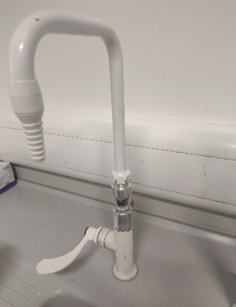
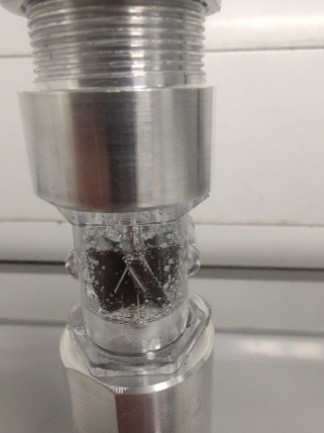
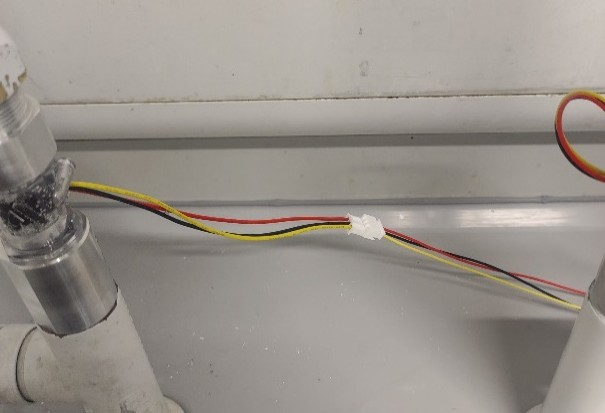
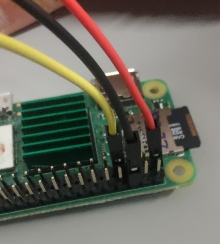
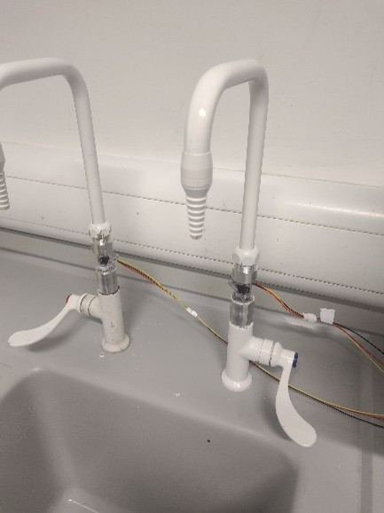
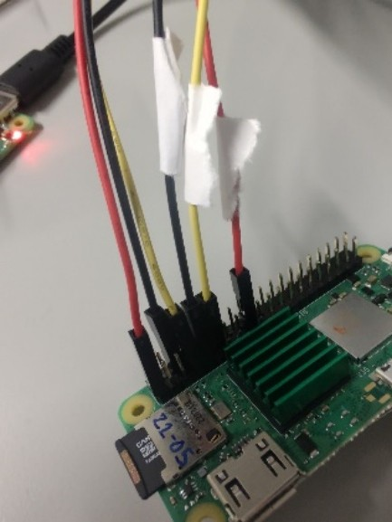
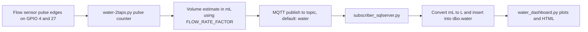

# Water Monitoring

This section documents the water-focused parts of LabSense, including data collection,
processing, and dashboard generation.

## Relevant Modules

- Labsense_Sensors/water-2taps.py: hardware-facing collection script for tap flow state.
- Labsense_SQL/water_dashboard.py: dashboard generation script for water insights.
- Labsense_SQL/subscriber_sqlserver.py: ingestion path used by utility data pipelines.

## Typical Workflow

1. Collect water-related signals from Raspberry Pi Pico W.
2. Ingest and store measurements in SQL Server.
3. Aggregate and visualize trends in the water dashboard.

## Setting up Water Sensors

### Hardware

Setting up the water flow tracker requires a turbine sensor installed in the water flow and a Raspberry Pi for control.

The test setup used **YF-S201C water sensors**, along with adapters that allow them to be fitted to commercial taps.

These can be purchased at [the Pi Hut](https://thepihut.com/products/clear-turbine-water-flow-sensor-with-3-pin-jst).

The setup has been successfully implemented using:

- Raspberry Pi Zero 2 W
- Raspberry Pi 4 Model B

The wires were protected using plastic heat-shrink tubing. It is recommended that this is applied before installation, once the wiring has been tested and confirmed to work.

---

### Single Tap Setup

#### Install the Water Sensor

Install the water sensor in the tap with the arrow pointing in the direction of water flow. Ensure all fittings are secure to minimise leakage.

{ .img-50 }

{ .img-70 }

{ .img-50 }

{ .img-50 }

The sensor has three wires:

| Wire Colour | Function |
|------------|----------|
| Red | Power |
| Black | Ground |
| Yellow | Data output |

The sensor terminates in a 3-pin JST-XH female connector.

Use a suitable extension cable with:

- JST-XH male connector on the sensor end
- 2.54 mm Dupont female connectors on the Raspberry Pi end

#### Raspberry Pi Zero 2 Wiring

Connect the wires as follows:

| Sensor Wire | Raspberry Pi Connection |
|------------|------------------------|
| Red | 3.3 V (Pin 1) |
| Black | Ground (Pin 6) |
| Yellow | GPIO 4 (Pin 7) |

> The red and black wires may be connected to any suitable 3.3 V and ground pins.
>
> The yellow wire **must** be connected to GPIO 4 (physical pin 7) unless the software is modified.

---

### Two Tap Setup

First, install the first sensor as described above.

Install the second sensor in the same way and connect it as follows:

| Sensor Wire | Raspberry Pi Connection |
|------------|------------------------|
| Red | 3.3 V (Pin 17) |
| Black | Ground (Pin 9) |
| Yellow | GPIO 27 (Pin 13) |

> Any suitable 3.3 V or ground pin may be used.
>
> Ensure the software configuration matches the GPIO pin assignments used.

{ .img-50 }

{ .img-50 }

#### Position the Raspberry Pi

Mount the Raspberry Pi away from potential water exposure to reduce the risk of damage.

---

### Troubleshooting

#### Error

```text
libopenblas.so.0: cannot open shared object file: No such file or directory
```

#### Solution

```bash
sudo apt-get install libopenblas-dev
```

#### Error

```text
No module named RPi
```

This may occur even when the package appears to be installed.

#### Solution

```bash
pip install RPi.GPIO
```

---

### References

#### Single Tap Script

- TBC

#### Two Tap Script

- [water-2taps.py](https://github.com/Cambridge-PAM/labsense/blob/main/Labsense_Sensors/water-2taps.py)

## How `water-2taps.py` Works

This section describes the runtime behavior of `Labsense_Sensors/water-2taps.py` in the same style as the ChemInventory pipeline documentation.

### Purpose

- Monitors pulse output from two YF-S201C flow sensors connected to GPIO.
- Converts pulses into estimated water volume (mL).
- Publishes measurements to MQTT when flow is detected.
- Supports graceful shutdown and local logging.

### End-to-End Data Flow



### Runtime Logic (what happens in code)

1. Loads `Labsense_Sensors/.env` and exits if the file is missing.
2. Initializes GPIO pins for two flow sensors and one status LED.
3. Attaches falling-edge interrupts to both sensor pins.
4. In a background thread, counts pulses and updates a per-second volume estimate.
5. In the async main loop:
	 - measures over `MEASUREMENT_INTERVAL` seconds,
	 - computes total measured water,
	 - publishes MQTT only when measured water is greater than zero,
	 - sleeps for `PUBLISH_DELAY` before the next cycle.
6. On SIGINT/SIGTERM, cleans up GPIO and exits safely.

### Important Behavior for Two-Tap Mode

- Both sensor interrupts increment the same shared counter.
- The script therefore reports a combined volume value for both taps, not per-tap volumes.
- Source identity is represented via `LAB_ID` and `SUBLAB_ID` fields in the MQTT payload.

### MQTT Payload Shape

The script publishes a Python-dict-style string that the subscriber normalizes for JSON parsing:

```text
{
	'labId': 1,
	'sublabId': 3,
	'ipAddress': '10.0.0.12',
	'sensorReadings': {'water': 42.7},
	'measureTimestamp': '2026-08-04 10:21:33'
}
```

`water` is sent in mL. In `Labsense_SQL/subscriber_sqlserver.py`, it is divided by 1000 before insert, so SQL stores litres.

## Water Sensor Script Configuration (`Labsense_Sensors/.env`)

Example configuration:

```env
# GPIO
FLOW_SENSOR_GPIO_1=4
FLOW_SENSOR_GPIO_2=27
LED_GPIO=2

# Pulse -> volume calibration
FLOW_RATE_FACTOR=5

# MQTT
MQTT_SERVER=192.168.1.10
MQTT_PATH=water
MQTT_PORT=1883
MQTT_TIMEOUT=10

# Lab metadata in payload
LAB_ID=1
SUBLAB_ID=3

# Timing (seconds)
MEASUREMENT_INTERVAL=5
PUBLISH_DELAY=10
```

Notes:

- `MQTT_SERVER` is required; script exits if missing.
- `FLOW_RATE_FACTOR` controls calibration and should be tuned to your sensor/install geometry.
- Keep `LAB_ID` and `SUBLAB_ID` aligned with your SQL/dashboard mapping.

## Running `water-2taps.py`

From repository root on the Raspberry Pi host:

```bash
python Labsense_Sensors/water-2taps.py
```

If your environment requires elevated GPIO access:

```bash
sudo python Labsense_Sensors/water-2taps.py
```

The script logs to console and to `Labsense_Sensors/water-2taps.log` when file write permission is available.

## Prerequisites for the Water Pipeline

- Raspberry Pi with compatible GPIO access.
- Two wired YF-S201C sensors (or equivalent pulse-output flow sensors).
- MQTT broker reachable from the Pi.
- SQL subscriber running (`Labsense_SQL/subscriber_sqlserver.py`) and subscribed to topic `water`.
- SQL connection configured for the subscriber in `Labsense_SQL/.env`.

## Running Water Dashboard Generation

From the repository root:

```bash
python Labsense_SQL/water_dashboard.py
```

## Operational Checks

- Verify environment variables in Labsense_SQL/.env are set correctly.
- Confirm source feeds (sensor or utility API) are accessible.
- Ensure SQL connectivity is available before running processing scripts.

## Troubleshooting

- If dashboard output is missing, validate that upstream ingestion has recent records.
- If SQL errors occur, re-check driver/server settings in environment configuration.
- If values appear flat or discontinuous, review sensor-side logging and timestamps.